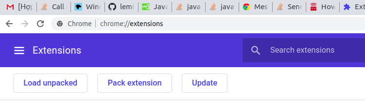

# Chrome Extension: FeedbackNow

An extension help to remind people to feedback subjects on time

### Preview


### Prerequisites
You're using Chrome browser

### Installing
1. First clone or download the repo
```
git clone https://github.com/leminhnguyen/FeedbackNow
```

2. Open browser and type the url below to access chrome extension
```
chrome://extensions
```

3. Turn on `Developer mode` at the top-right corner

    

4. Load unpacked

    Click `Load unpacked` button at the top-left corner and browser to folder cloned from step 1

    

5. Done, open the your extension

    Setup your times

    

    When the time matched, a popup fired
    
    

## Author
- nguyenlm

## License

This project is licensed under the MIT License


